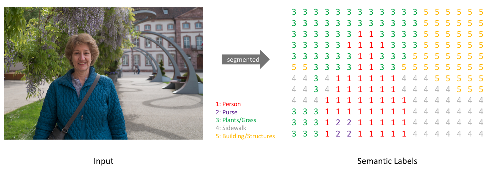

# 计算机视觉的一些术语

## Semantic Image Segmentation

The goal of semantic image segmentation is to label each pixel of an image with a corresponding class of what is being represented. Because we're predicting for every pixel in the image, this task is commonly referred to as dense prediction.

语义图像分割的目的是用表示的图像的相应类别标记图像的每个像素。 因为我们要为图像中的每个像素进行预测，所以此任务通常称为密度预测。

## 单应性变换\(Homography Transformation\)

The homography transformation is the mapping function from one plane to another.

单应性变换就是一个平面到另一个平面的映射关系。

## Attention Model

> [https://zhuanlan.zhihu.com/p/31547842](https://zhuanlan.zhihu.com/p/31547842)

Attention是一种用于提升基于RNN（LSTM或GRU）的Encoder + Decoder模型的效果的的机制（Mechanism），一般称为Attention Mechanism。Attention Mechanism目前非常流行，广泛应用于机器翻译、语音识别、图像标注（Image Caption）等很多领域，之所以它这么受欢迎，是因为Attention给模型赋予了区分辨别的能力，例如，在机器翻译、语音识别应用中，为句子中的每个词赋予不同的权重，使神经网络模型的学习变得更加灵活（soft），同时Attention本身可以做为一种对齐关系，解释翻译输入/输出句子之间的对齐关系，解释模型到底学到了什么知识，为我们打开深度学习的黑箱，提供了一个窗口，如下图所示。

又比如在图像标注应用中，可以解释图片不同的区域对于输出Text序列的影响程度。

